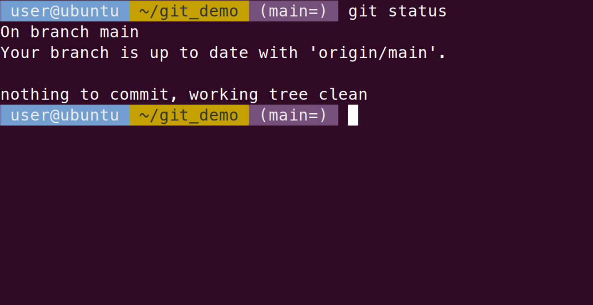

# `git_basics`

This repo houses slides from a presentation on `git` and `Github` that was given to members of
the robotics department at the University of Manchester.

As the name suggests, the presentation aimed to give an overview of the very
basics of `git`.

***Disclaimer: There are links to external websites in these slides. No one at the
University of Manchester claims any responsibility for the content of these
links. No one who contributed to the making of this resource is connected to
the external sites in any way. They are purely for informational purposes***

## What's in this folder?

### Presentation Slides

TL;DR the slides are in [a pdf](presentation/slides/slides.pdf) which may or may
not be up-to-date.

Included in the presentation folder there are several copies of the slides:

* A Markdown copy
* A html copy
* A pdf copy

The slides were created with Marp. To view the html slides correctly or to update
the pdf it is necessary to install [Marp cli](https://github.com/marp-team/marp-cli).

If you simply wish to use the slides as a reference the pdf should be
sufficient, although there is no guarantee it is up-to-date (feel free to raise
an issue if needed).

### An annotated bash history from the session

Is in history.txt. It has been tidied up and abridged.

### A snippet to add to your .bashrc file to show git info in the prompt

As requested by attendees of the session, the contents of this file can be added to your .bashrc file to give you a user prompt similar to below.

This is adapted from:

* [How to Pimp Up the Git Bash Prompt on Windows (without any
External Stuff)](https://medium.com/@damianczapiewski/how-to-pimp-up-the-git-bash-prompt-on-windows-without-any-external-stuff-c69eb9ef0125)
* [Adding your Git Status to your Bash prompt](https://jon.sprig.gs/blog/post/1940)
